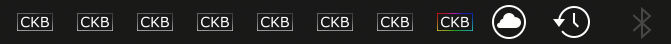

### Final Post

#### About The Requested Feature
My group and I have been working on the monochrome tray icon feature[[1]](#one) for the last two weeks[[2]](#two).  
The community wanted to be able to switch the CKB tray icon from the color to monochrome, so that it may match the other tray icons.  
We are proud to say that we have developed a functional implementation of this feature[[3]](#three).  

   

---
#### Reaching a Solution
Our group has been talking to the one of the most, recently active[[4]](#four) repo maintainers, Tasos Sahanidis ([tatokis](https://github.com/tatokis) on GitHub), through the team's IRC chat channel, `#ckb-next`[[5]](#five).  

We reached out to get some feedback on our initial implementation[[6]](#six). This is when tatokis let us in on some of the flaws of our code and recommended some resources to lead us in the direction of a functional solution.  
We were not updating the existing menu and its respective components, but instead we had been simply hiding the old menu and creating new menus without ever deleting the old ones.[[7]](#seven)  
  
This was an embarrassing oversight, on our part, due to our prior experience with C++ and memory management.  

We originally were deleting the old menus but then made the incorrect assumption that the `QSystemTrayIcon::hide()`[[8]](#eight) function may be doing that for us. We were also reseting the entire menu manually, in our code, as opposed to searching for some tool to modify individual components. One example of this would be how we dynamically created new `QActions` just to reset their text. With some basic google-ry, we would have quickly found out that the `QAction` class has a function, `setText()`[[9]](#nine), specifically to replace the text.  

The __QT documentation__[[10]](#ten) was super clear and definitely mitigated some of the difficulties that come with learning a new framework. I, personally, loved it so much that I kept reading more of it due to its ease of use/navigation, readability, and simplicity. I certainly plan on using this myself and seeing what ideas I can bring to life.  

Tatokis let us know that the `CkbSettings`[[11]](#eleven) class would allow the icon color change to persist past the session in which it was changed. The `CkbSettings` class is a wrapper for the `QSettings`[[12]](#twelve) QT class which provides the ability to load and store user settings for a QT application.  

Tatokis has been an extremely pleasant person to work with and our group is extremely thankful for his time and guidance.  

---
#### Conclusions
The feature is stable on macOS.
Sometimes, on Ubunutu 18.04, after choosing the option to switch the tray icon color, it will erratically switch between "Monochrome Tray Icon" and "RGB Tray Icon".  
This only occurs when a user attempts to switch the color rapidly and continuously. Doing the same on macOS does not cause any unexpected behavior.  

#### Reflections on This Course
It has been a pleasure to be part of this course and learning experience. Everyone that I've worked with has been extremely enthusiastic, helpful, and understanding.  
I hope to see many of my peers again next semester and I am eager to see what this course has to offer in the Spring.  

Stay strong, positive, and healthy!  
Much love:heart:  

---
#### Sources & References
[1](#one-src): [CKB-Next, Issue #58: Monochrome Icon](https://github.com/ckb-next/ckb-next/issues/58)  
[2](#two-src): [Monochrome tray icon development](https://github.com/DanieSegarra36/ckb-next/tree/monochrome-tray-icon)  
[3](#three-src): [Commit of working, tray icon color switch](https://github.com/DanieSegarra36/ckb-next/commit/a2b568dabe1a56e244c00c61b598b7b19c6fecf9)  
[4](#four-src): [CKB-Next Contributors](https://github.com/ckb-next/ckb-next/graphs/contributors)  
[5](#five-src): [Contact the CKB-Next team](https://github.com/ckb-next/ckb-next#contact)  
[6](#six-src): [Our initial implementation of the tray icon color switch feature](https://github.com/DanieSegarra36/ckb-next/commit/dd6022bd2bc9d2dd2caac985af5fca8c7f31cb72)  
[7](#seven-src):   
[8](#eight-src): [Hiding the tray icon menu, QSystemTrayIcon::hide()](https://doc.qt.io/qt-5/qsystemtrayicon.html#hide)  
[9](#nine-src): [Changing a AQction's text, QAction::setText()](https://doc.qt.io/qt-5/qaction.html#text-prop)  
[10](#ten-src): [QT Library Documentation](https://doc.qt.io/qt-5/classes.html)  
[11](#eleven-src): [CkbSettings](https://github.com/ckb-next/ckb-next/blob/master/src/gui/ckbsettings.h)  
[12](#twelve-src): [QSettings](https://doc.qt.io/qt-5/qsettings.html)  